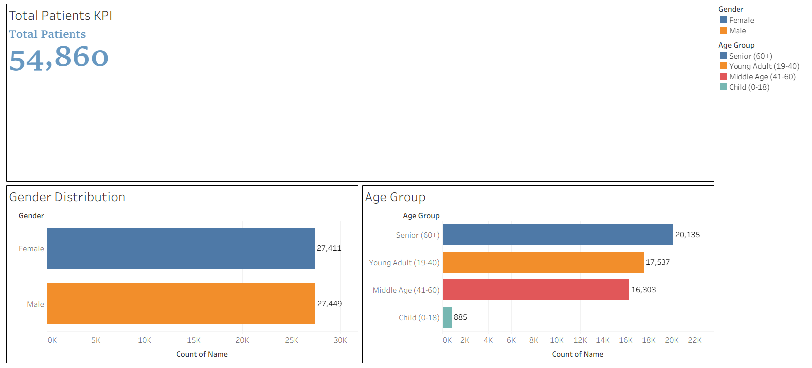

# Personalised Healthcare Recommendation

A data analytics project built using Python and Tableau to analyze healthcare patient records and generate rule-based personalized healthcare recommendations.

This project focuses on understanding patient demographics, medical conditions, admission patterns, and healthcare costs, and transforming these insights into actionable recommendations through data analysis and interactive dashboards.

--- 

[](https://www.python.org/) 
[](https://www.tableau.com/)

---

## 📌 Table of Contents
- [About the Project](#about-the-project)
- [Features](#features)
- [Tech Stack](#tech-stack)
- [Analysis Workflow](#analyss=is-workflow)
- [Project Structure](#project-structure)
- [Installation](#installation)
- [Usage](#usage)
- [Screenshots](#screenshots)
- [Future Enhancements](#future-enhancements)
- [Conclusion](#conclusion)
- [Author](#author)

---

## About the Project

The Personalized Healthcare Recommendation project performs an end-to-end analysis of healthcare patient data to identify key trends, risk segments, and cost drivers.

The primary goal is to demonstrate core data analyst skills such as:

- Data understanding and cleaning
- Exploratory Data Analysis (EDA)
- Patient segmentation using logical rules
- Business-focused insights
- Rule-based personalized recommendations
- Dashboard creation using Tableau

The project covers:

- Cleaning and preprocessing raw laptop data
- Creating meaningful features for analysis
- Performing structured analysis using SQL
- Building interactive dashboards using Tableau

---

## Features

- 🧹 Data cleaning and preprocessing using Python (Pandas)
- 📊 Exploratory Data Analysis (EDA) on patient demographics and costs
- 👥 Patient segmentation based on age, billing amount, and medical condition
- 🧠 Rule-based personalized healthcare recommendations
- 📈 Interactive Tableau dashboards for insights and storytelling
- 📌 Business-oriented healthcare insights and reporting

---

## Tech Stack

- **Language:** Python
- **Libraries:** Pandas, NumPy, Matplotlib, Seaborn
- **Visualization:** Tableau
- **Working Environment:** Jupyter Notebook

---

## Analysis Workflow

- Raw healthcare data ingestion and validation
- Data cleaning and preprocessing
- Exploratory Data Analysis (EDA)
- Patient segmentation using logical rules
- Rule-based personalized healthcare recommendations
- Dashboard creation and insights visualization using Tableau
- Business-ready reporting

---

## Project Structure

```bash
personalized-healthcare-recommendation-data-analysis/
│
├── data/
│   ├── raw/
│   │   └── healthcare_patient_records_2024.csv
│   │
│   └── cleaned/
│       └── healthcare_cleaned.csv
│
├── notebooks/
│   ├── 01_data_overview.ipynb
│   ├── 02_data_cleaning.ipynb
│   ├── 03_exploratory_data_analysis.ipynb
│   ├── 04_patient_segmentation.ipynb
│   └── 05_rule_based_recommendations.ipynb
│
├── tableau/
│   ├── healthcare_dashboard.twbx
│   └── screenshots/
│       ├── patient_overview.png
│       ├── disease_analysis.png
│       ├── cost_risk_analysis.png
│      
│
├── reports/
│   └── personalized_recommendations.xlsx
│   
│
├── visuals/
│   ├── age_distribution.png
│   ├── disease_vs_age.png
│   ├── gender_distribution.png
│   └── billing_analysis.png
│
├── requirements.txt
└── README.md


```

---

## Installation

Clone the repository

```bash
git clone https://github.com/Sujaltyagi09/personalised-healthcare-recommendation-data-analysis.git


```
Navigate to the Project Directory

```bash
cd personalised-healthcare-recommendation-data-analysis

```

Install Dependencies

```bash
pip install -r requirements.txt
```

---

## Usage

- Run Jupyter notebooks sequentially from the notebooks/ folder
- Use the cleaned dataset for analysis and segmentation
- Open the Tableau workbook (healthcare_dashboard.twbx) to explore dashboards
- Review insights and recommendations from the reports/ folder

---

## Screenshots

### Dashboard
<p align="center">
  
</p>

### Cost-Risk-Analysis
<p align="center">
  
</p>

### Disease-Analysis
<p align="center">
  
</p>

---

## Future Enhancements

- Incorporating time-series analysis for patient admissions
- Adding hospital-level performance comparisons
- Enhancing recommendation logic using more healthcare metrics
- Integrating real-time data sources

---

## Conclusion

This project demonstrates a complete data analytics lifecycle applied to the healthcare domain.
It highlights strong analytical thinking, explainable rule-based decision making, and effective data visualization, making it highly relevant for Data Analyst roles.

---

## Author

Sujal Tyagi
- [Github](https://www.github.com/Sujaltyagi09)
- [LinkedIn](https://www.linkedin.com/in/sujal-tyagi-3ba820296/)
- [Email](sujaltyagi906@gmail.com)

